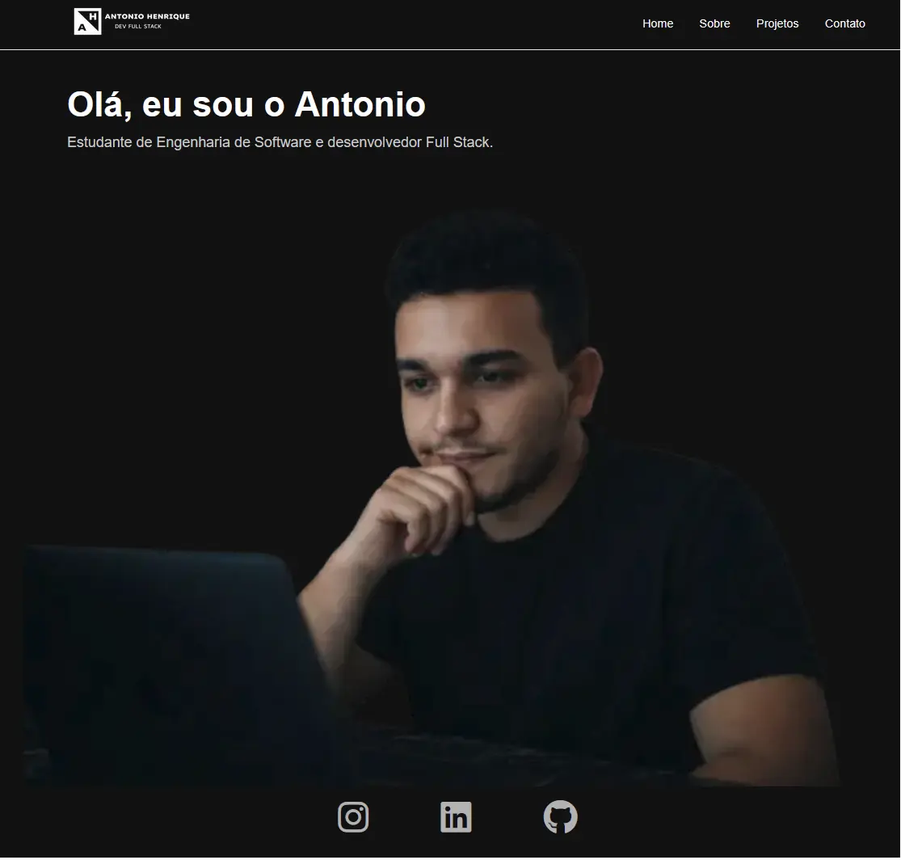

# 💼 Portfólio — Antonio Henrique

Este é meu portfólio pessoal como desenvolvedor Full Stack em formação, com foco em **Java, Spring Boot e aplicações web modernas**.

O objetivo deste projeto é apresentar minhas habilidades técnicas, projetos e evolução como desenvolvedor.

---

## 🌐 Acesse o projeto

👉 https://ahss-dev.github.io/portfolio/

---

## 🖼️ Preview



---

## 🚀 Tecnologias utilizadas

* HTML5
* CSS3
* JavaScript
* Responsive Design
* Intersection Observer API
* Animações com CSS

---

## ✨ Funcionalidades

* Layout responsivo (mobile → desktop)
* Animações suaves ao scroll
* Menu mobile interativo
* Otimização de performance (imagens otimizadas)
* SEO básico configurado
* Open Graph para compartilhamento de links

---

## 📂 Estrutura do projeto

```
portfolio/
│
├── Images/
├── CSS/
│   └── style.css
├── JS/
│   └── script.js
└── index.html
```

---

## ▶️ Como executar localmente

Clone o repositório:

```
git clone https://github.com/ahss-dev/portfolio.git
```

Abra o arquivo `index.html` no navegador.

---

## 📈 Melhorias futuras

* Componentização de seções
* Otimizações adicionais de performance
* Novos projetos no portfólio Full Stacks

---

## 👨‍💻 Autor

**Antonio Henrique**

* LinkedIn: https://www.linkedin.com/in/antonio-henrique-soares-santos-9a4073316
* GitHub: https://github.com/ahss-dev

---

⭐ Se você gostou do projeto, fique à vontade para deixar uma estrela no repositório!
