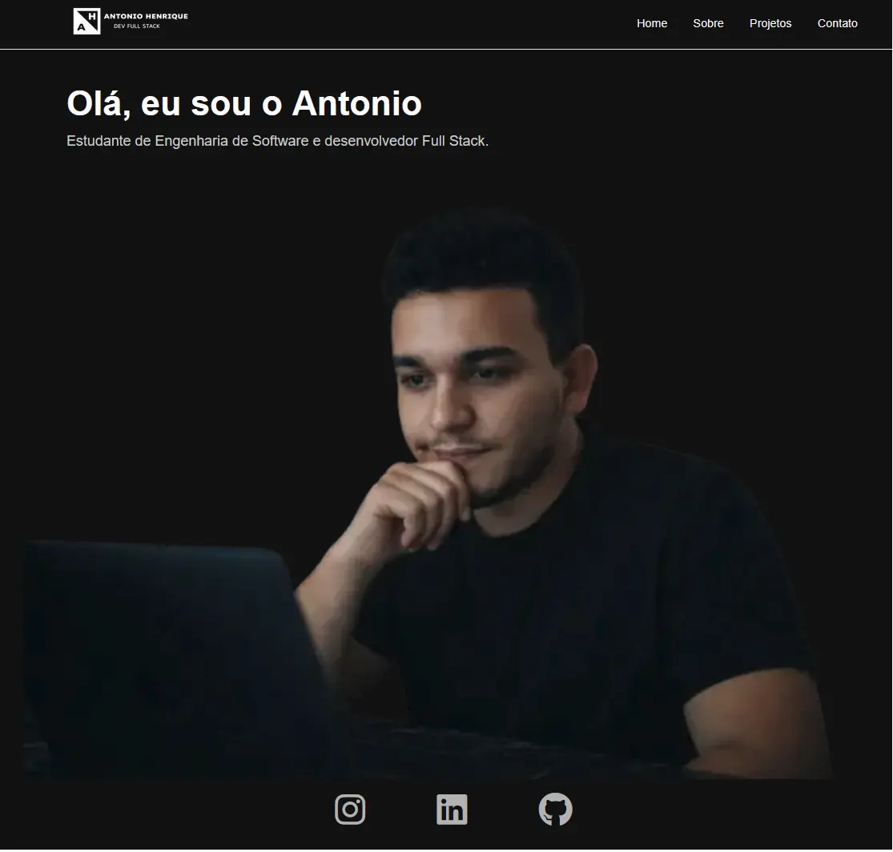

💼 Portfólio — Antonio Henrique

Este é meu portfólio pessoal como desenvolvedor Full Stack em formação, com foco em Java, Spring Boot e desenvolvimento de aplicações web modernas.

O projeto foi criado para centralizar meus projetos, demonstrar minhas habilidades técnicas e documentar minha evolução como desenvolvedor.

🔹 🌐 Acesse o projeto

👉 https://ahss-dev.github.io/portfolio/

🔹 📌 Sobre o projeto

Este portfólio foi desenvolvido com o objetivo de apresentar meus projetos, tecnologias utilizadas e minha evolução na área de desenvolvimento de software.

O site reúne:

    • Projetos desenvolvidos

    • Tecnologias e ferramentas que utilizo

    • Informações profissionais

    • Formas de contato

Além disso, o projeto foi construído com foco em:

    • Performance

    • Boas práticas de desenvolvimento

    • Experiência do usuário

    • Design responsivo

🔹 🖼️ Preview

🔹 🚀 Tecnologias utilizadas

Este projeto foi desenvolvido utilizando tecnologias modernas da web:

    • HTML5

    • CSS3

    • JavaScript

    • Responsive Design

    • Intersection Observer API

🔹 ⚡ Performance e Otimização

O projeto foi otimizado para oferecer carregamento rápido e excelente experiência ao usuário.

Resultados obtidos nos testes com Lighthouse (Firefox):

Métrica	Resultado

    • Performance	95%

    • Accessibility	98%

    • Best Practices	96%
    
    • SEO	100%

Principais métricas de carregamento:

    • First Contentful Paint: 2.3s

    • Largest Contentful Paint: 2.4s

    • Total Blocking Time: 0ms

    • Cumulative Layout Shift: 0

    • Speed Index: 2.3s

🔹 ✨ Funcionalidades

O portfólio possui diversas funcionalidades voltadas para experiência do usuário:

    • Layout totalmente responsivo (mobile → desktop)

    • Animações suaves ao scroll

    • Menu mobile interativo

    • Otimização de imagens

    • SEO básico configurado

    • Open Graph para compartilhamento em redes sociais

🔹 📂 Estrutura do projeto
    portfolio/
    │
    ├── Images/
    ├── CSS/
    │   └── style.css
    ├── JS/
    │   └── script.js
    └── index.html
🔹 ▶️ Como executar localmente

Clone o repositório:

git clone https://github.com/ahss-dev/portfolio.git

Depois abra o arquivo index.html no navegador.

## 🔹 🧠 Desafios encontrados

Durante o desenvolvimento enfrentei alguns desafios, como:

    • Reduzir o Cumulative Layout Shift (CLS)
    • Melhorar o carregamento de imagens
    • Garantir responsividade em diferentes tamanhos de tela
    • Melhorar a Acessibilidade

Esses problemas foram resolvidos com ajustes no carregamento de imagens e melhorias no CSS.

🔹 📈 Melhorias futuras

Algumas melhorias planejadas para evolução do projeto:

    • Componentização das mídias sociais

    • Melhorar animações e microinterações

    • Adicionar novos projetos Full Stack

🔹 👨‍💻 Autor

Antonio Henrique

🔗 LinkedIn
https://www.linkedin.com/in/antonio-henrique-soares-santos-9a4073316

💻 GitHub
https://github.com/ahss-dev

⭐ Se você gostou do projeto, considere deixar uma estrela no repositório.